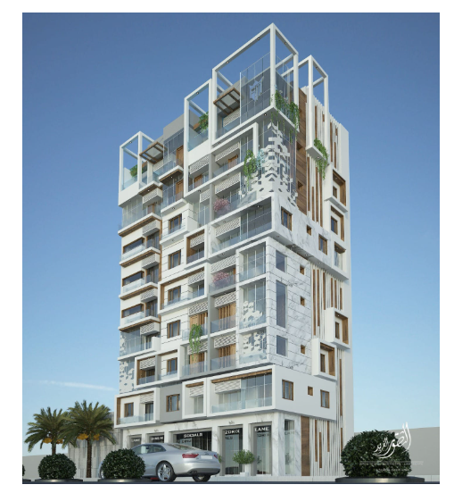
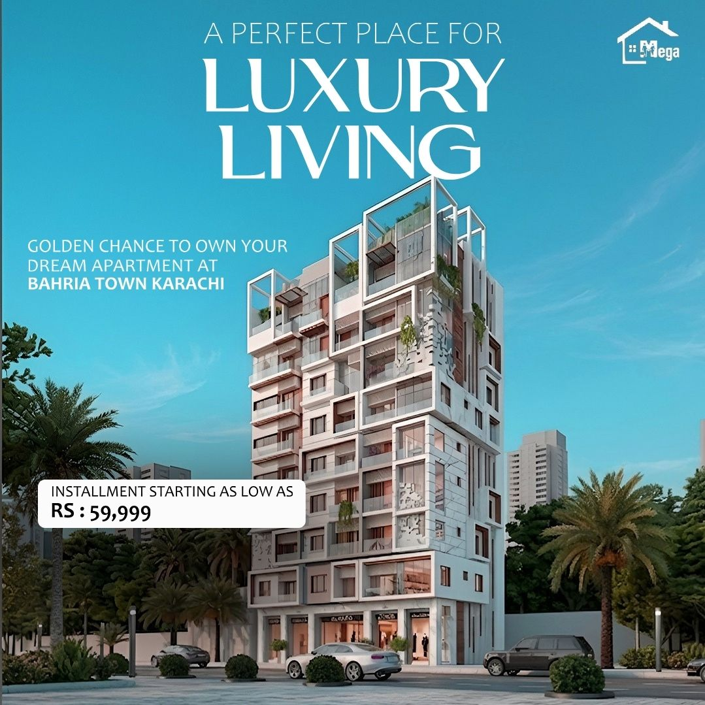

# My Internship Design Projects

Company: DevelopersHub Corporation
Role: Graphic Design Intern
Started: May 2026
Tools: Adobe Photoshop + AI

---

## Project 1 — Bahria Town Luxury Living Post

I was given a raw building image on Day 1 of my internship.
My task was to create a real estate marketing post in 1 hour.

### My Process:
- Step 1: Studied the raw image I was given
- Step 2: Searched for luxury real estate ad inspiration  
- Step 3: Enhanced image quality using AI tools
- Step 4: Designed the final post in Adobe Photoshop

### Before and After:
Raw Image Given To Me:

Final Post I Created:

---

Contact: maazakram356@gmail.com
LinkedIn: linkedin.com/in/maazakram-849654409
